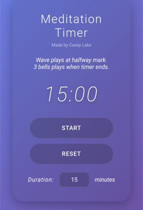

# kcMeditate

A simple meditation timer, designed and deployed as a progressive web app. The session length is now edited directly from the large timer display before you start.

The timer app can be viewed online at:

**https://caseylabs.com/apps/simple-meditation-timer/**



## Local development

Build the local non-root container image:

```sh
make build
```

Run the app on `http://localhost:8000`:

```sh
make run
```

Stop the running container:

```sh
make stop
```

Remove the local image:

```sh
make clean
```

## Tests

```sh
make test
```
